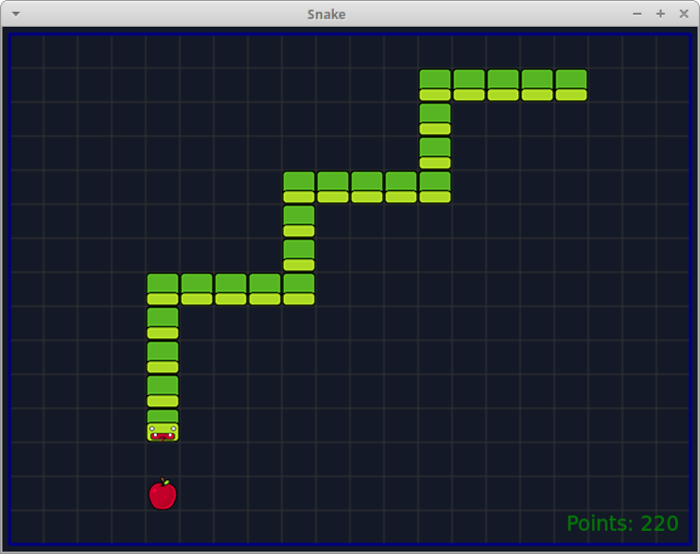
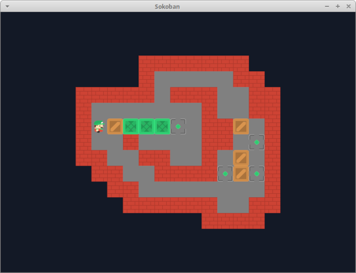

# pyside-games

Some simple games developed with PySide6

## Snake

## Sokoban

**Controls**

  - Arrow keys -> Move player
  - U -> Undo last move
  - R -> Restart level
  - ESC -> Choose level
  - n,p -> Next,Prev level

**Credits**

Graphics are modified version of [Kenney's](https://kenney.nl/assets/sokoban) ones

Microban and Sasquatch levels sets by [David W. Skinner](http://www.abelmartin.com/rj/sokobanJS/Skinner/David%20W.%20Skinner%20-%20Sokoban.htm)

**Useful links**

- [Open Game Art](https://opengameart.org)
- [Sokoban Online](https://www.sokobanonline.com/)
- [The basics of Sokoban level formats ...](https://alonso-delarte.medium.com/the-basics-of-sokoban-level-formats-for-designing-your-own-sokoban-levels-51882a7a36f0)
- [Rust Sokoban](https://sokoban.iolivia.me/)

## Hexoban

[TODO]

A variant of Sokoban originally described by [David W. Skinner](http://www.abelmartin.com/rj/sokobanJS/Skinner/David%20W.%20Skinner%20-%20Sokoban.htm).
Follows the same rules of Sokoban but on an hexagonal grid

**Credits**

Levels:
- [Hexcotet](https://aymericdupeloux.wixsite.com/sokoban/post/hexocet)
- [Heloban](http://hexoban.free.fr/index.php?lg=en&z=player&p=collections)
- [Heroban](http://hexoban.free.fr/index.php?lg=en&z=player&p=collections)

- [StackOverflow: What's a good algorithm to generate a maze?](https://stackoverflow.com/questions/38502/whats-a-good-algorithm-to-generate-a-maze)
